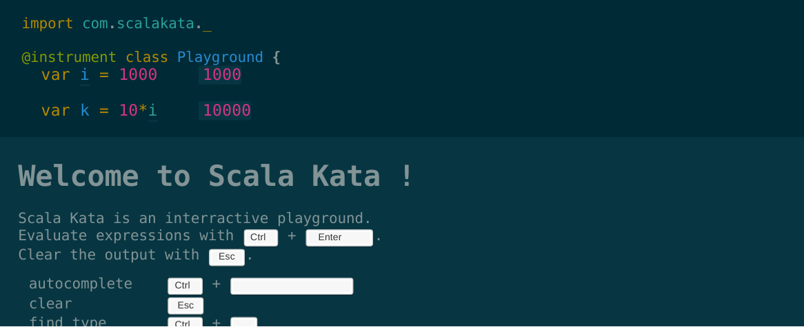

[[Home]](../ReadMe.md) [[2. Your First Lines Of Code]](02.%20Your%20First%20Lines%20Of%20Code.md)

# 1. Preliminaries

Hi!

Welcome to my course of programming. My name is Joan, I'm doing Scala programming to pay my bills and for fun, my nickname on GitHub is [@joan38](https://github.com/joan38). With this tutorial, I will teach you how to code with the programming language **Scala**.
Even if you've never touched any line of code in your life, you will be able to understand this course because it starts from zero.

This chapter is by the way made for you! I will explain the usefulness of a programming language.  
We will then install everything to start coding.

Have a nice reading!

## Programming languages

This is a tutorial to learn **programming**, so you will learn how to make applications.

> :raising_hand: What is an application? :grimacing:

An application? It's everything you are using on your computer:
* Web browsers (Google Chrome, Firefox, Internet Explorer...)
* Calculator
* Text editors (Notepad, Microsoft Word...)
* Games (Counter Strike, Call of duty, Pokemon...)

To create an application we need to use a **programming language**. In fact, your computer speaks only one language: the **binary language**. It's a succession of 0 and 1, for example 0100000101111001011011010110010101101110 :flushed: Don't be worried, nobody writes applications directly in binary in these days, and fortunately :relieved:.

> :raising_hand: But if computers understand only the **binary language**, how are we going to communicate with them?

That is why we have **programming languages**! They offer us the possibility to write code, that is easily understandable by humans. We then use an application that translates what we wrote, in **binary code** which the computer understands.

In Scala (the language you will learn in this tutorial) the translation from the **programming language** to the **binary code** is done in 2 steps:

1. We translate the **programming language** to an intermediary code called **Bytecode**.  
   The **Bytecode** is the application the users will have on there computer.  
   The **Bytecode** can be read by an application called the **JVM (stands for Java Virtual Machine)**.
2. And then the **Bytecode** is translated in **binary code** on the fly at the time the application is ran by the user.  
   The **Bytecode** is translated in **binary code** by the **JVM** installed on the computer of the user.

So basically this is exactly the same as a Word document!

1. We translate the **text** to an intermediary stored in **.docx** files.  
   The **.docx** is the document the users will have on there computer.  
   The **.docx** can be read by an application called **Word**.
2. And then the **.docx** is translated in **binary code** on the fly at the time the document is opened by the user.  
   The **.docx** is translated in **binary code** by the **Word** installed on the computer of the user.

Try to read the 2 steps multiple time to really understand.

> :raising_hand: Ok, but why don't we translate the **programming language** directly to the **binary code**?

Many programming languages translate directly to the binary code. But there is multiple advantages to use a **virtual machine** (the JVM for Scala):
* Run on any computers that have the JVM installed.
* The **virtual machine** is able to make clever optimisation according to the computer it's running on.

We will not discuss this topic in depth but it is important for you to understand how will run the applications you will write and why you need to install the JVM to run them.

## Why learning Scala?

Because it's awesome!

## Getting ready to go!

Before installing anything, I will present you a website where you can test the code of this tutorial without downloading or installing anything. This website is **[Scala Kata](http://www.scalakata.com)** and here is what it looks like:  
  
You can use this website for the first chapters, but then we will need a proper setup on your computer.

### The developement environnement

#### Java Development Kit (JDK)
I already told you that applications written in Scala runs on the **JVM**. We will now install the **JDK**.

> :raising_hand: You spoke about the **JVM**, why do we now have to install the **JDK**? And what is it?

The **JDK** is as superset of the **JVM**, and contains **everything that is in the JVM, plus developer tools** such as the application that translates Scala (the **programming language**) to the **Bytecode**.  
In other words the **JDK** is for developers and the **JVM** is for users that will run your application.

Go on Oracle's website -> **Downloads** -> **Java for Developers** and install the latest version of the JDK. Here is a [direct link to download the JDK](http://www.oracle.com/technetwork/java/javase/downloads/index.html).  
  
Then accept the **License Agreement** (after reading and agreeing it of course :weary:) and download the version corresponding to you operating system. It only remains to install it.

#### SBT - Scala Build Tool or Simple Build Tool
To **compile** our application we will use **SBT**, that stands for Scala Build Tool or Simple Build Tool.

> :raising_hand: OK but what does **compile** an application means?

Compile? It's the way to **transform** the programming language (the Scala code that humans and soon you too :blush: can undestand), in binary language (0100000101111001011011010110010101101110 that the computer understand).

> :information_source: SBT let us do much more than just compiling our application but we won't get into it here.

To install SBT let's go on http://www.scala-sbt.org/, click on **Download**, download the version corresponding to your operating system (Windows or others) and install it.

One of the fonctionnality of SBT is the **interactive console** (also called interpreter). The interactive console is basically the same as [Scala Kata](http://www.scalakata.com) but on your computer.  
So open a **[Command Prompt](http://windows.microsoft.com/en-gb/windows-vista/open-a-command-prompt-window)** and type `sbt console`. You should see something like this:
```console
C:\Users\Joan> sbt console
[info] Set current project to joan (in build file:/C:/Users/Joan/)
[info] Updating {file:/C:/Users/Joan/}joan...
[info] Resolving org.fusesource.jansi#jansi;1.4 ...
[info] Done updating.
[info] Starting scala interpreter...
[info]
Welcome to Scala version 2.10.4 (Java HotSpot(TM) 64-Bit Server VM, Java 1.8.0_71).
Type in expressions to have them evaluated.
Type :help for more information.

scala>
```

The interpreter welcomes you :open_mouth: and display the versions of Scala and the JVM, and some blabla and wait you to write something.

> :raising_hand: What should we write in?

Nothing for now. We will do in the following chapter. Don't leave this console frighten you, we will use it only in the first chapters. We will then use the IDE Intellij Idea.

### The IDE Intellij Idea
  
An **IDE** (stands for Integrated Developement Environement) is a program that will help you to code more easily: code coloration, automatique indentation, project management, compilation... The **IDE** we will use is **Intellij Idea**.

Intellij Idea had its success thanks to its **intelligent coding assistance** that gives relevant suggestions according to the context: instant and clever code completion, on-the-fly code analysis and reliable refactoring tools.  
Developers usualy call it "Idea" because it's shorter to prononce and to write.

> :information_source: We will not use this IDE for the first chapiters, you can leave the installation for later.

Go on https://www.jetbrains.com/idea/, download and install the "Community Edition" that contains all we will need.

Once installed, start Intellij Idea.  
You will end up on a configuration wizard that asks you the theme you want to use. Select the one that you like (personally I have a preference for Dracula because it's less tiring for the eyes :eyes: and I look like a movie hacker :skull:) and click on **Next**:  
  

The next step is the choice of plugins. Leave the default values and click on **Next: Featured plugins**:
  

This step is important to us as we can download the plugin Scala that will, as you can guess, write Scala code :smiley:. Click on **Install** in the **Scala** box.  
  
And finally click on **Start using IntelliJ IDEA**.

You now have a general idea of programming with Scala. You probably have learned some new words like **binary language** and **IDE**.

The serious stuff will start in the next chapter. Take your courage in both hands and... gooo!

[[Home]](../ReadMe.md) [[2. Your First Lines Of Code]](02.%20Your%20First%20Lines%20Of%20Code.md)
