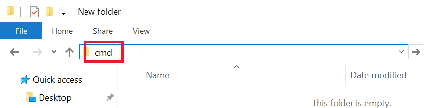

[[6. Functions]](06. Functions.md) [[Home]](../ReadMe.md) [[8. Collections]](08. Collections.md)

# 7. Objects

You know how to write **functions**, use them and store the result in **values** of **variables**.  
Now you might want to **organize** your code and group all those functions and values in **structures** that make sense to you? The **objects** are the solution to your needs, here is the syntax:
```scala
object NAME {
  BODY
}
```
* `object` is the **keyword** of the language to create an **object**.
* *NAME* is the name we want to give to our **object** (for example Cup, Car, Greeting).
* *BODY* is where you will write all your **functions** and **values**.

Let's create our first **object**:
```scala
scala> object Greeting {
     |   val greetingWord = "Hello"
     |
     |   def greeting(name: String) = greetingWord + " " + name
     | }
defined module Greeting
```
You can see Scala telling you that the module (object) `Greeting` has been created.

> :raising_hand: That's beautiful, how can I use it now?

Just add the name of the **object**, a dot and the name of the value or function you want to call:
```scala
scala> Greeting.greetingWord
res0: String = Hello

scala> Greeting.greeting("Joan")
res1: String = Hello Joan
```

## Terminology

We can't name an object as we want, there is some rules to follow, the name:
* can contains **letters** and **digits** but no white space (space, tab, new line).
* can't start with a digit.
* should be different from key words reserved for the language.

Thus the names `1ab`, `I'llBe`, `*` or `I am` are not valid. But `Yes`, `Hello` and `Purée` are valid.

Other than the limitations imposed by the language, programmers have agreed on a **naming convention** where they always start the name of an object with a **uppercase letter** and for objects named with multiple words (for example "price calculator"), they will use the **PascalCase** notation ("PriceCalculator" :heavy_check_mark:) and never words separated by underscores ("Price_Calculator" :x:).

## Little extra

Functions called `apply` are a bit special, they are the **default** function of objects. That means you can call them without the name:
```scala
scala> object Greeting {
     |   val greetingWord = "Hello"
     |
     |   def apply(name: String) = greetingWord + " " + name
     | }
defined module Greeting

scala> Greeting("Joan")
res2: String = Hello Joan
```

> :raising_hand: What if I have no parameters? How Scala is going to make the difference between `Greeting` the object and `Greeting` the call to `apply`?

It is not going to work, you need to add **empty brackets** even if there is no parameters:
```scala
scala> object Greeting {
     |   val greetingWord = "Hello"
     |
     |   def apply() = greetingWord + " you"
     | }
defined module Greeting

scala> Greeting()
res3: String = Hello you
```
 
## Creating an SBT project

Now that you know how to organise your code in objects I think it's time for you to store the code you write in **files** and so create a project with **SBT**.

Create a **folder** somewhere in your computer where you will store all your Scala files (I called it `ScalaCourse`).  
Then create a file in your project folder called `Greeting.scala`, open it with **Notepad** and copy/paste in it our previous example:
```scala
object Greeting {
  val greetingWord = "Hello"

  def greeting(name: String) = greetingWord + " " + name
}
```

Now type `cmd` in the **address bar** of you file explorer and press **Enter** to open a **command prompt** in your project folder, just like that:  
  
Type the command `sbt console`. You should see something like this:
```console
C:\Users\Joan\Documents\ScalaCourse>sbt console
[info] Set current project to scalacourse (in build file:/C:/Users/Joan/Documents/ScalaCourse/)
[info] Updating {file:/C:/Users/Joan/Documents/ScalaCourse/}scalacourse...
[info] Resolving org.fusesource.jansi#jansi;1.4 ...
[info] Done updating.
[info] Starting scala interpreter...
[info]
Welcome to Scala version 2.10.4 (Java HotSpot(TM) 64-Bit Server VM, Java 1.8.0_71).
Type in expressions to have them evaluated.
Type :help for more information.

scala>
```
SBT tells you that you are in the project `scalacourse`.  
By default this project name has been picked from the name of the project folder, but if you want to set the name of your project to be independent of the folder's name, you can create a `build.sbt` file in your project folder and add the following:
```scala
name := "Scala Course"
```
It is highly recommanded to create this `build.sbt` file for multiple reasons:
* Your project might move and live in a different folder where the name is not the same and you can have a name with special character that folders don't support.
* The `build.sbt` file marks that the folder we are in is a SBT project.

As you can see SBT tells you `Welcome to Scala version 2.10.4`, but `2.10.4` is not the latest version of Scala.  
So as we are in your `build.sbt` file, I would also recommand to set the Scala version to the latest which is `2.12.1` (when I wrote this), so your `build.sbt` file should look like this:
```scala
name := "Scala Course"
scalaVersion := "2.12.1"
```

You should now be able to use the `Greeting` object as you want:
```scala
scala> Greeting.greeting("Joan")
res0: String = Hello Joan
```
Bear in mind that if you **modify/add/delete** any file in the project you will have to type `exit` and then `sbt console` again to load the new files.

## Exercises

#### Exercise 1

1. Write an object `PriceCalculator` that contains the value of the **tax rate**. [:scroll: Solution](solutions/07. Objects/Exercise 1.1.md)
2. Add to `PriceCalculator` a function to calculate the **tax** of a given price (reuse the value of the tax rate). [:scroll: Solution](solutions/07. Objects/Exercise 1.2.md)
3. Add to `PriceCalculator` a function to calculate the **price including taxes** of a given price (reuse the function created in the question 2.). [:scroll: Solution](solutions/07. Objects/Exercise 1.3.md)

[[6. Functions]](06. Functions.md) [[Home]](../ReadMe.md) [[8. Collections]](08. Collections.md)
