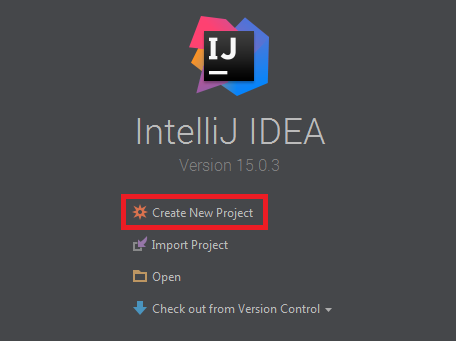
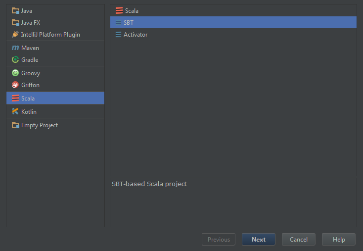
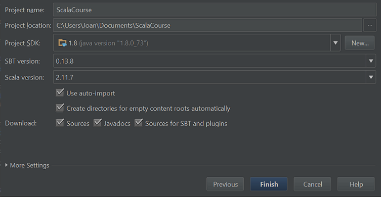
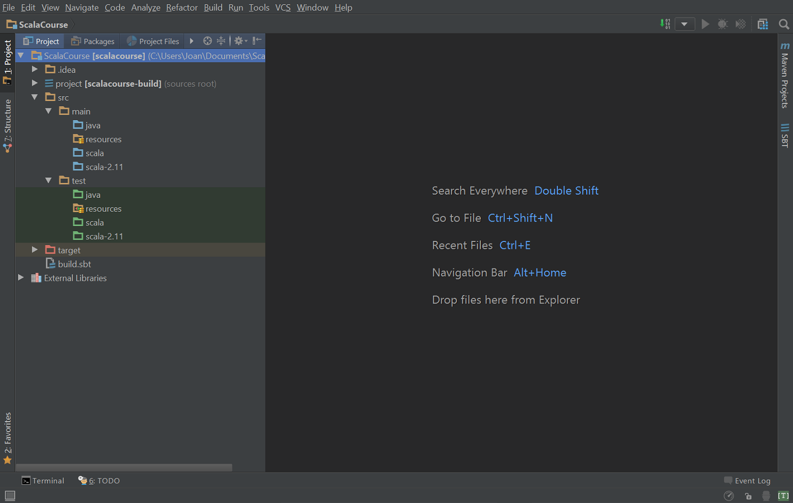
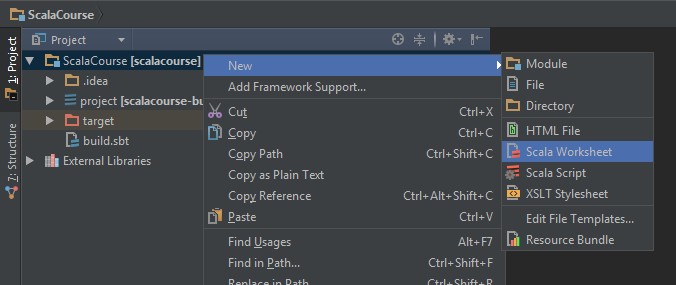
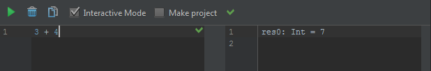

# 11. Using an IDE

Now that you know how to organise your code in objects I think it's time for you tu learn how to use an **IDE** like **Intellij Idea**.

> :information_source: If you haven't installed Intellij Idea it's time to do it now.

Run Idea and click on **Create New Project**:  
  

Select **Scala** in the left panel, as we want to create a Scala project, and **SBT** in the right panel, because it's out preferred build tool:  
  
Click **Next**

In this view we will set the basic project settings:    

* Set the project name.
* Choose a location where to store your project.
* Project SDK is actually the JDK, remember it's the JVM + the developer tools to compile and run your application.  
  If you don't have any click on `New` and browse to where you installed the JDK in the [Preliminaries chapter](01. Preliminaries.md#java-development-kit-jdk). Mine is `C:\Program Files\Java\jdk1.8.0_73` so yours should be something liek this.
* Check all the boxes:
  * `Use auto-import` will automatically update Idea when you change the settings in your `build.sbt` file.
  * `Create directories for...` will create all the directories where you will put your code in.
  * `Download: Sources; Javadocs...` will download all the documentation you will need to understand what your code is doing.

Click on **Finish**

Don't be afraid by the number of buttons in the cockpit.
Let's have a tour of what we have here.

 

#### Top bar

* You have all the menus like `File`, `Edit`, `View`...
* A path that shows you where is the file you are currently viewing in the body. Currently it shows just the name of your project as you don't have anything open.
* On the right we have a button to **compile** the application, running configuration and run buttons, Project configuration and a Search everywhere button.

#### Left Bar
* `Project` shows the panel that shows all your files in the project.
* `Structure` shows the panel that shows the structure of the currently opened file (as there is not file currently open it shows nothing).

#### Project Panel
* `ScalaCourse` is our root project folder. `[scalacourse]` is the name of the project given by SBT. Remember you can edit this name in the `build.sbt` file.
* `.idea` is the folder where idea will put his stuff in. We will not touch this folder.
  
  > :information_source: Folders starting with a dot (`.`) are supposed to be hidden folders on Linux and Mac. On Windows hidden folders are set differently that's why you see or not this folder depending on which system you are.
* `project` is an SBT folder that contains all the configuration related to SBT, for example plugins, version of SBT to use...
* `target` is where SBT puts all the outputs, for example your application compiled, your application packaged...
* `build.sbt` is the SBT file that contains all the configuration related to your project, for example the name, the Scala version...
* `External Libraries` is all the list of the libraries we use in our project. You don't need to worry about this for now, we will come back on what is a library in a future chapiter.

#### Body
This big part contains the opened files in an editor. Here it shows just some indications about how to open a file because there is nothing opened.

#### Right Bar

This bar contains the panels related to the build tools like SBT. We don't care about Maven Projects as we are not using this build tool.

#### Bottom bar

* `Terminal` is a Command Prompt just like you used until now.
* `Problems` shows you all the problems you have in you code when you compile it.
* `Event Log`  is where all the notification will go if you miss them, just like the notification drawer you have on your phone.

## Scala Worksheet

Create a Scala Worksheet:  

And try out some of the code we have seen in this tutorial:  

> What! :anguished: We had that from the beginning and you left us using the console! Why? :sob:

Because I'm wicked :smiling_imp:.  
Because I wanted you to learn using the console and show you that an IDE like Idea is just a text editor to help you and not the application that turns your code to an application.

## Create an Object

Let's try creating an object:

## Exercices

Coming soon
